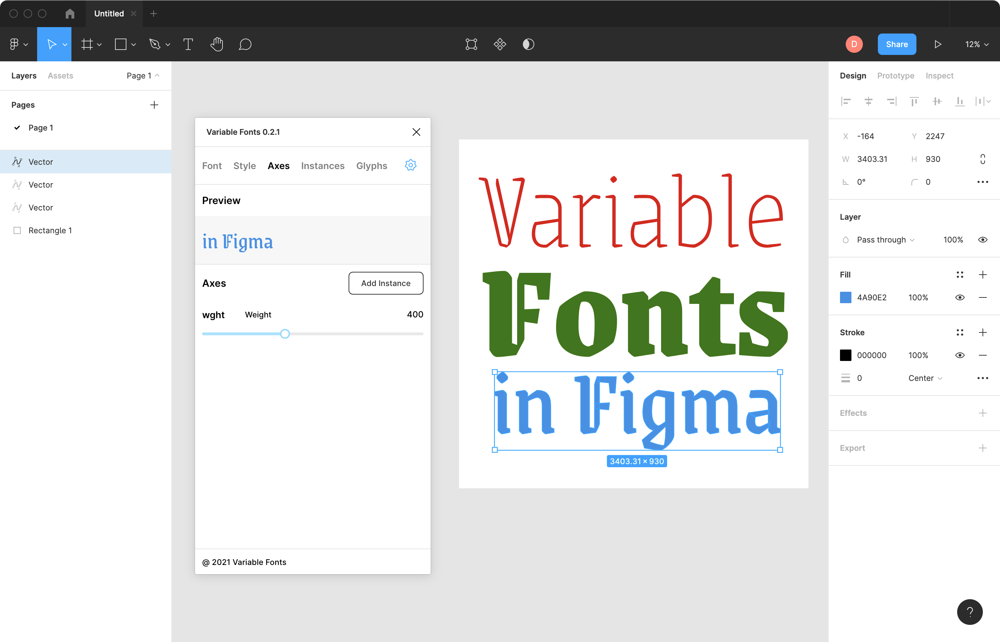

# Figma Variable Fonts

"If you can play [DOOM](https://twitter.com/possan/status/1193164022885081089) in Figma, why not use variable fonts?" - [Lenny](https://twitter.com/rememberlenny)

A plugin to provide basic variable fonts support through Samsa.js.

This plugin allows you to:

- Render variable fonts in the Figma canvas
- Create static font instances, using a variable font's variable axes
- Load the static instances in a variable font's fvar table
- Preview, display, and update variable fonts
- Add and edit text for variable fonts to the Figma canvas

## Install

**1. Obtain a built copy of the plugin.**

A simple way is to download an release asset zip from this repo's [releases page](https://github.com/Tgemayel/variable-fonts-figma/releases) (`Archive.zip`) and unzip it.

**2. Install the plugin within Figma's desktop client.**

Go to Menu → Plugins → Development → New Plugin

This will bring up the "Create a plugin" modal dialog.
In the lower 2nd section to "Link existing plugin", click to choose a manifest.json file, and select the `manifest.json` file in the folder you downloaded this plugin to.

## Usage

Run the Figma desktop client, and open or create a new file.

Go to Menu → Plugins → Development → Variable Fonts

You should see the Variable Fonts palette appear, similar to the screenshot above.

You can select from the dozens of variable fonts in the [Google Fonts](https://fonts.google.com/?vfonly=true).
A "upload any font" feature is planned soon, but currently the button for it doesn't do anything.

In the Preview section, enter some custom text.
Set the color and axes values you want.
Then click the **Add** button at the top of the Preview section.

This will add a Vector graphic object to your Figma file.

The plugin remembers which Vector graphic objects it created, and their text remains editable in the plugin panel.

You can now use the Vector like normal, with all Figma's other tools and plugins for graphics.

## Development

As of April 2021, this plugin is still in an early phase of development - but it is a "MVP," and basically works.

Please contribute ideas and suggestions to the Github issue tracker:

[github.com/tgemayel/variable-fonts-figma/issues](http://github.com/tgemayel/variable-fonts-figma/issues)

#### Contributing Code

If you are a developer, you may prefer to download the source code from this repo and built it yourself, using [yarn](https://yarnpkg.com), instead of using a pre-built release.

The dependencies can be conveniently installed on macOS with [Homebrew](https://brew.sh) and on Windows with [Chocolatey](https://chocolatey.org).
If you use Windows, replace the following `brew` command with `choco`.

To install Homebrew, open Terminal and run these 2 commands:

    /bin/bash -c "$(curl -fsSL https://raw.githubusercontent.com/Homebrew/install/master/install.sh)";
    brew doctor;

You will be offered to install the Command Line Developer Tools from Apple.
Confirm by clicking Install.
After the installation finishes, continue installing Homebrew by hitting Return again.

Then install git, yarn, and the Figma desktop client, download this repo, and build it:

    brew install git yarn figma;
    git clone https://github.com/Tgemayel/variable-fonts-figma.git;
    cd variable-fonts-figma;
    yarn;
    yarn build:watch;

The final command means that if you update the source code, it will rebuild automatically on save.
Just close the plugin and reopen it to see how your changes work.

Pull requests are welcome!

## License

Apache License 2.0

## Thanks

Thanks to [Dave Crossland](https://twitter.com/davelab6) for organizing this project, [Lenny Bogonoff](https://twitter.com/rememberlenny) for initial prototyping, and the Google Fonts team for generously supporting development.
